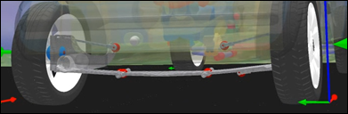

# Health Monitoring of Composite Structures

**Particular Highlight of Application**

- Health Monitoring of light-weight composite structure.
- Predictive maintenance.
- Real-time capability of component with distributed properties.
- Option to protect model information provided by supplier.
- Compared to FMI 2.0, visualization of elastic deformation field in system simulation.

**Model Rationale**

The weight of automotive suspension components influences the dynamic characteristics of the suspension and, consequently, passengers’ ride comfort and vehicle’s road holding capabilities. The use of light-weight composite structures in automotive suspensions, exemplified by an experimental rear axle design shown in the picture above, may therefore provide an option to improve the riding and handling quality and to reduce the overall weight of the vehicle and in turn its energy consumption in addition.

However, suspension components are subjected to wear and fatigue due to dynamic loads excited by rough roads and driving conditions. Compared to classic components made of steel, composite structures exhibit several exceptional damage mechanisms such as delamination, break and buckling of fibers or joint failures, and their long-life behavior is much more difficult to predict in a reliable manner.

Therefore, it might be a valid concept to implement a model-based structural health monitoring system (SHM) in order to support the usage of light-weight composite structures.  SHM monitors and accumulates dynamic loads acting on suspension components in operation, predicts wear and fatigue, and observes the dynamic properties of components online in Electronic Control Units (ECUs).

On this basis maintenance measures may be initiated and organized early enough in order to avoid function degrading or even failures and collapses. Thus, the safety and availability of the car is guaranteed throughout its lifetime. On the long run, the collection of load and integrity data from real life supports the engineering of future suspension designs and helps to improve upcoming products.

**Modeling Overview**

- PDE-semi-discretization: Finite Elements
- Physical domain: Mechanics
- Industrial background: Automotive

**Modeling Items**

- PDE: FEM model of the composite structure.
- Model Reduction: mesh, reduced mass and stiffness matrices, retained degrees of freedom
- Post processing:
  -	visualization data such as wavefront or stl-files
  -	transformation from inertial frame (FEM) to floating frame of reference description in multibody simulation
  -	information to specify physical (multibody) connector
- System model: multibody vehicle model including sensor information
